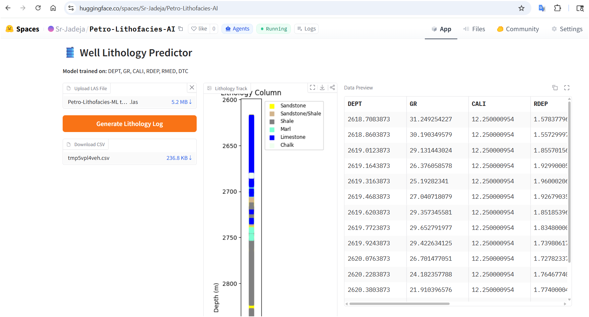
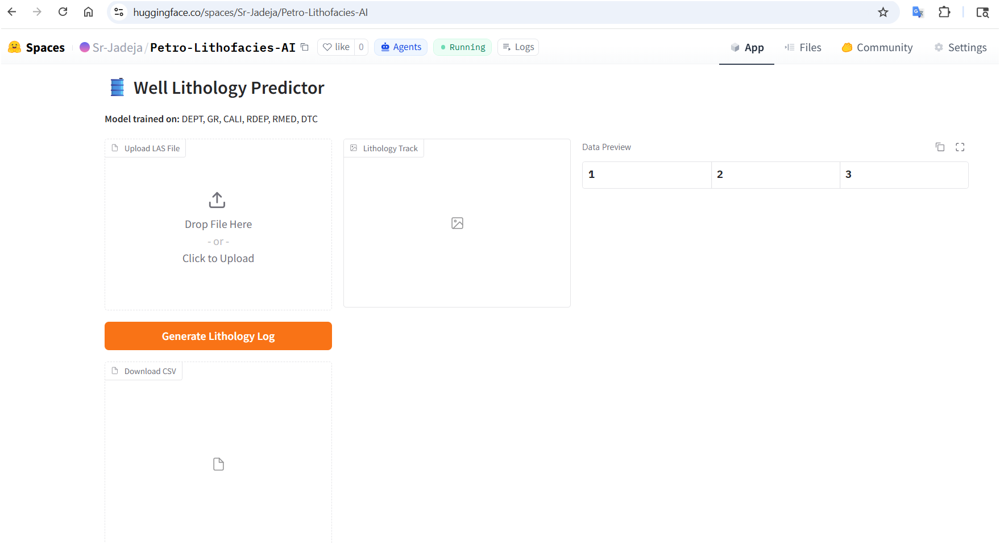

# Petro-Lithofacies-ML
An end-to-end machine learning project that performs automated rock type classification (Lithofacies) from well log data and generates a vertical geological strip using a Random Forest architecture.

The project also includes a Gradio web app hosted on Hugging Face for interactive inference.

---

## Problem Statement
Manually identifying lithology from well logs is a time-intensive task prone to human subjectivity. The goal of this project is to build a multiclass classification system that takes raw .LAS wireline data and outputs a depth-indexed geological log.

---

## Solution Overview
- Implemented a Random Forest classification model optimized for multi-log inputs.

- Used the FORCE 2020 North Sea dataset for robust training across 12 rock classes.

- Exported the trained model and scaler in .pkl format for efficient deployment.

- Developed a Gradio web app to upload LAS files and visualize geological columns.

The system outputs:

- Tabular prediction preview.
- Vertical lithology track visualization.
- Exportable CSV with predicted facies IDs.

---

## Model Architecture
- Algorithm: Random Forest Classifier.
- Input Features: Gamma Ray (GR), Caliper (CALI), Deep Resistivity (RDEP), Medium Resistivity (RMED), Shallow Resistivity (RSHA).
- Labeling: 12-class lithofacies mapping (Sandstone, Shale, Coal, etc.)

---

## Tech Stack

- Python  
- Scikit-Learn  
- Lasio (Log Interpretation)
- Matplotlib (Geological Plotting)
- Gradio (Web Interface)
- Hugging Face Spaces (Hosting)

---

## Training
- The model was trained using the massive FORCE 2020 well log competition dataset.
- Preprocessing included handling missing values and log-transformation of resistivity curves.
- Final trained weights and scalers are stored in the data/ directory.

---

## Run the Web App

Upload any standard .LAS file to: https://huggingface.co/spaces/Sr-Jadeja/Petro-Lithofacies-AI

The app will:
  - Generate a depth-indexed lithology log.
  - Provide a downloadable CSV of results.

---

## Results
The system generates a vertical geological strip that mimics professional petrophysical software outputs. This allows geologists to identify sand/shale sequences and reservoir boundaries.