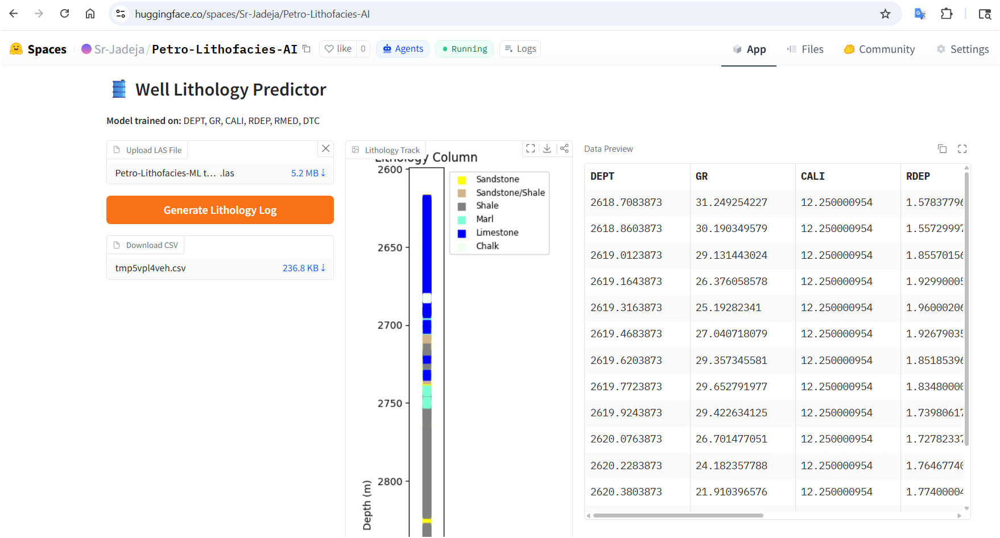
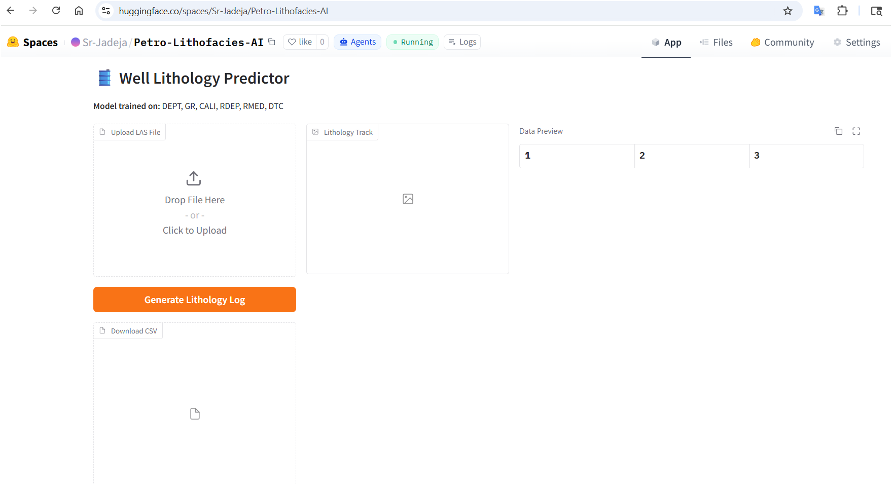

# Petro-Lithofacies-ML
An end-to-end machine learning project that performs automated rock type classification (Lithofacies) from well log data and generates a vertical geological strip using a Random Forest architecture.

The project also includes a Gradio web app hosted on Hugging Face for interactive inference.

---

## Problem Statement
Manually identifying lithology from well logs is a time-intensive task prone to human subjectivity. The goal of this project is to build a multiclass classification system that takes raw .LAS wireline data and outputs a depth-indexed geological log.


---

## Project Structure

```
Petro-Lithofacies-ML/
├── bulk_processing.py      # Convert .las folder → master CSV
├── clean.py                # Clean master CSV → training-ready CSV
├── train.py                # Train model, save .pkl + evaluation plots
├── app.py                  # Gradio inference app
├── data/
│   ├── master_training_data.csv    # Output of bulk_processing.py
│   ├── cleaned_master_data.csv     # Output of clean.py
│   ├── lithology_model.pkl         # Output of train.py
│   └── lithology_scaler.pkl        # Output of train.py
├── requirements.txt
└── screenshots/
```

---

## Setup

```bash
pip install -r requirements.txt
```

---

## Run

```bash
# Step 1: Convert raw LAS files to one CSV
python bulk_processing.py

# Step 2: Clean and prepare training data
python clean.py

# Step 3: Train the model
python train.py

# Step 4: Launch the app
python app.py
```

---

## Model Details

- Algorithm: Random Forest Classifier.
- Input Features: Gamma Ray (GR), Caliper (CALI), Deep Resistivity (RDEP), Medium Resistivity (RMED), Shallow Resistivity (RSHA).
- Labeling: 12-class lithofacies mapping (Sandstone, Shale, Coal, etc.)

**Live Demo:** [Hugging Face Spaces]
Upload any standard .LAS file to: https://huggingface.co/spaces/Sr-Jadeja/Petro-Lithofacies-AI



The app will:
  - Generate a depth-indexed lithology log.
  - Provide a downloadable CSV of results.


---

## Tech Stack

Python, Scikit-Learn, Lasio (Log Interpretation),Matplotlib (Geological Plotting), Gradio (Web Interface), Hugging Face Spaces (Hosting)